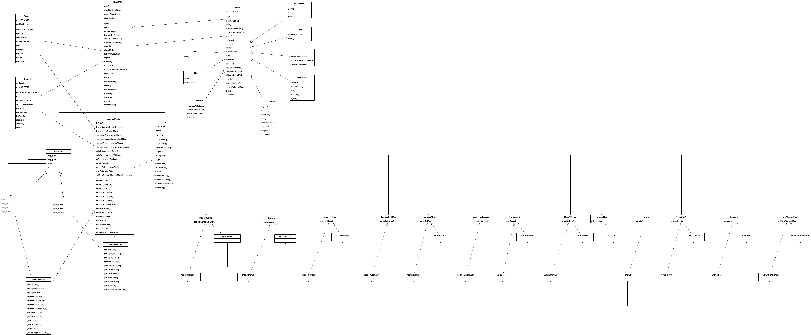

# Spring 2022 CS586 project

## 1.MDA-EFSM model for the Account components


MDA-EFSM Events:

    Open()
    Login()
    IncorrectLogin()
    IncorectPin(int max)
    CorrectPinBelowMin()
    CorrectPinAboveMin() 
    Deposit() BelowMinBalance() 
    AboveMinBalance()
    Logout()
    Balance()
    Withdraw() WithdrawBelowMinBalance() NoFunds()
    Lock()
    IncorrectLock()
    Unlock()
    IncorrectUnlock()
    Suspend()
    Activate()
    Close()

MDA-EFSM Actions:

    A1: StoreData()     // stores data from temporary area in data store 
    A2: IncorrectIdMsg()    // displays incorrect ID message
    A3: IncorrectPinMsg()   // displays incorrect pin message
    A4: TooManyAttemptsMsg() // display too many attempts message
    A5: DisplayMenu() // display a menu with a list of transactions
    A6: MakeDeposit()  // makes deposit (increases balance by a value stored in temp_d in data store)
    A7: DisplayBalance() // displays the current value of the balance
    A8: PromptForPin() // prompts to enter pin
    A9: MakeWithdraw()  // makes withdraw (decreases balance by a value stored in temp_w data store) 
    A10: Penalty()  // applies penalty (decreases balance by the amount of penalty)
    A11: IncorrectLockMsg() // displays incorrect lock msg
    A12: IncorrectUnlockMsg()   // displays incorrect unlock msg
    A13: NoFundsMsg()   // Displays no sufficient funds msg


## 2. Class diagram
### In the folder 'class-diagram-class.png' is a high-definition picture


## 3. a sequence diagrams for ACCOUNT-1
### In the folder 'cclass-diagram-sd.png' is a high-definition picture


## 4 Packaging step

### step1 install maven 

### step2 
```shell
cd {project_root}

mvn package

chmod +x target/CS586_project-1.0.jar

java -jar target/CS586_project-1.0.jar
```


